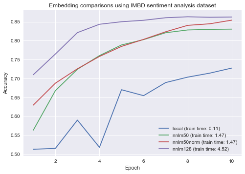

### Comparison between text embeddings from Tensorflow Hub

This repository contains various experiments run on different text problem datasets. Models with the same architecture and parameters are run for each problem, with the only difference being how the text was embedded. Different pretrained embeddings from https://tfhub.dev/s?module-type=text-embedding are compared to each other, as well as a locally trained embedding.

Note that train times are in minutes, and they don't include the time required to download the model.

#### IMBD Sentiment Analysis:  

[Dataset details](https://www.tensorflow.org/datasets/catalog/imdb_reviews)   
[Notebook for this experiment](imbdSentimentAnalysis.ipynb)

Embeddings tried: [NNLM 50](https://tfhub.dev/google/nnlm-en-dim50/2), [NNLM 50 with normalization](https://tfhub.dev/google/nnlm-en-dim50-with-normalization/2),
[NNLM 128](https://tfhub.dev/google/nnlm-en-dim128/2)

#### Wikipedia Article Classification:

Coming soon!
